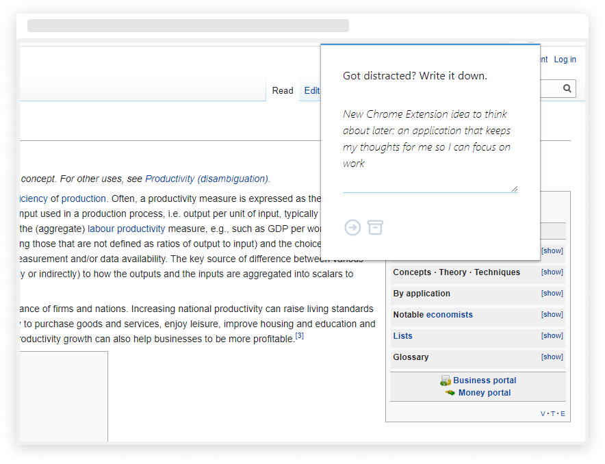

# Distraction Journal
[English] [Português](readmept.md)

Google Chrome extension that stores your side-thoughts with locale storage while you scroll around.

## 🤓 Code
This is a very short demonstration of what popup extensions can do in Google Chrome. A good example to give you an insight on how it works and also help with the most intriguint part - how to save data once the popup closes. The code is as minimalistic and friendly as it can be therefore good for learning therefore I'm keeping it here.

## 😁 Getting Started
In case you wanna use and test it:
1. Clone this repository:

        https://github.com/nydndr/distraction-journal.git

2. Go to Chrome Extensions Manager on you browser:

        chrome://extensions

3. 'Load Unpacked Extension' and choose the repo you've just cloned
4. Have ~~fun~~ work!

## 🧰 Built With
The visuals of it were facilitated by [Tailwind.css](https://github.com/tailwindcss/tailwindcss) and [HeroIcons](https://heroicons.dev/).

## 👋 Author
I'm Nicoly Dandara. And I do spend too much in the internet.
I design and I code, both things that require me to be focused and use the internet at the same time, which is a huge challenge and that's why this extension exists.

## 🧐 Acknowledgements
* Had fun reading tons and tons of - well written - documentation from Google Chrome.
* Improved my understanding of localStorage and communication between files.

## 😎 Future
This is as simple and as is necessary and I don't intend to change this.

* [ ] Make it a Firefox extension.

--- 

### License

[MIT License](LICENSE.md)
